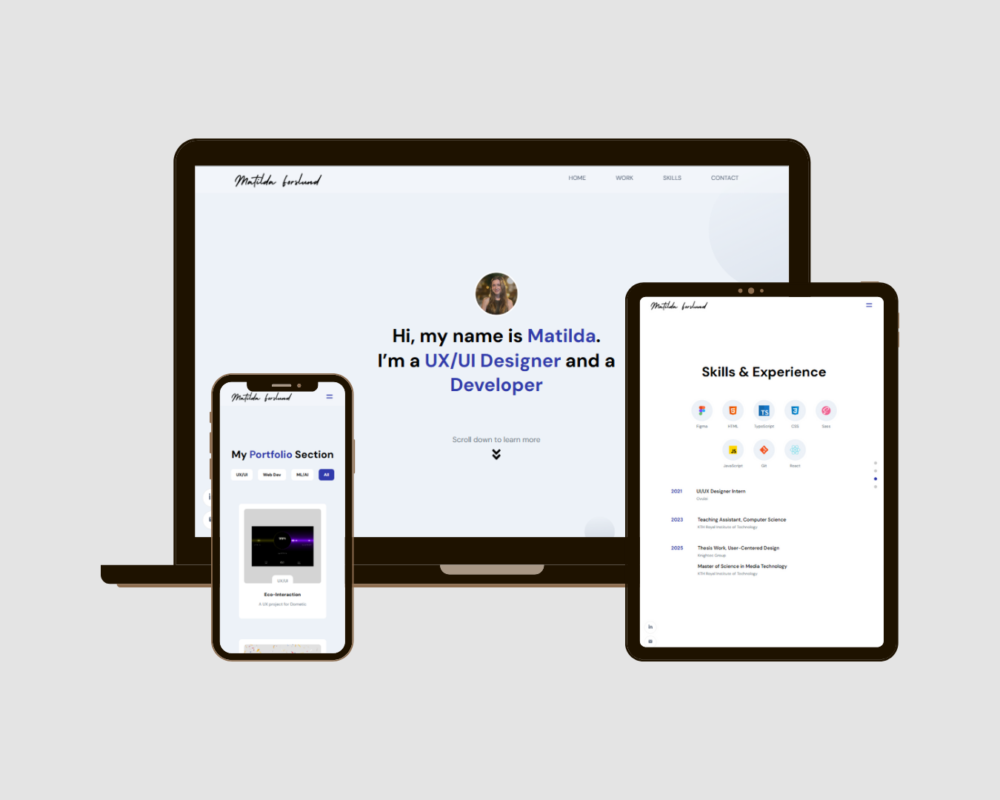

# Portfolio Website

  
*A screenshot of the deployed portfolio site.*

---

## Overview
This is my personal portfolio website. 

Originally started from a tutorial, it was extended into a multi-page, fully responsive website with custom design and tailored features. The project demonstrates modern web development practices using React, SCSS, and Sanity.io for content management, along with interactive UI elements and smooth animations.

---

## Tech Stack
- **Frontend:** React, JavaScript, HTML, SCSS  
- **Backend / CMS:** Sanity.io  
- **Design & Prototyping:** Figma  

---

## Features
- Multi-page layout with smooth navigation  
- Animated components and interactive UI elements  
- Responsive design for mobile, tablet, and desktop  
- Content managed via Sanity.io for easy updates  
- Custom design based on Figma prototypes  

---

## Deployment
The deployed site can be viewed here: [Portfolio Link]()

---

## Acknowledgements
- Original tutorial: [Youtube link](https://youtu.be/3HNyXCPDQ7Q?si=pMDpvtHSTnIGOz7S)
